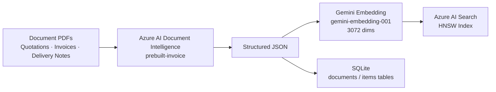
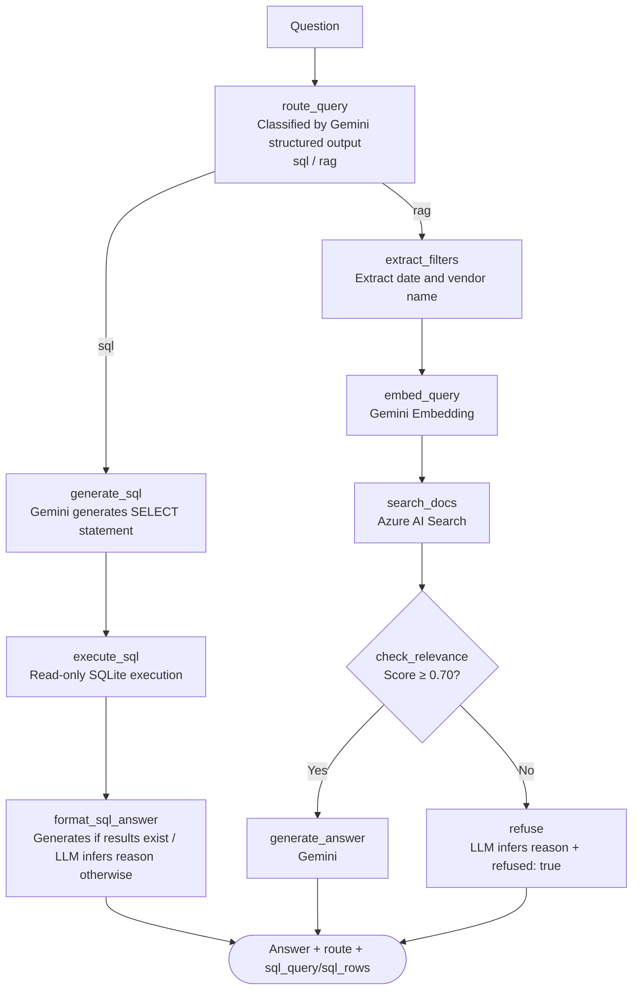

[🇯🇵 日本語](README.md) | [🇬🇧 English](README.en.md)

# order-system-rag

[](https://github.com/yktsnet/order-system-rag/actions/workflows/ci.yml)

A portfolio demo that uses trade document PDFs from the procurement domain (quotations, invoices, delivery notes) to show side-by-side how RAG and Text-to-SQL answer the same question differently — demonstrating the design decision of "choosing the right tool based on the nature of the question."

## Quick Start

### Prerequisites

- Docker Desktop
- API keys for Azure AI Document Intelligence, Azure AI Search, and the Gemini API

### Setup

```bash
cp .env.example .env
# Set each API key in .env (see .env.example)
docker compose up -d --build
```

App: http://localhost:8094

## Overview

Data extracted from document PDFs is loaded into two stores — Azure AI Search for vector search and SQLite for structured search — so both a RAG answer and a Text-to-SQL answer can be compared side by side for a single question.

### Demo UI

| Tab | Content |
|---|---|
| Document Management | A list of 30 quotation, invoice, and delivery-note PDFs received from vendors, with a JSON preview. A drag-and-drop upload area illustrates the "continuously arriving documents" business flow. |
| Data Search | Question → two-column comparison of Text-to-SQL and RAG. The routing node classifies the question type and shows a recommended-method badge with its reasoning. Each answer includes step-level logs. |
| How It Works | Illustrated explanation of the structural differences between Text-to-SQL and RAG, with a question-pattern breakdown of strengths and weaknesses. |

By making the Document Management tab the main view, the context that "these 30 PDFs are the source data" carries naturally into the Data Search tab.

## Architecture

### Data Pipeline



The same extraction output (JSON) is loaded into both Azure AI Search for vector search and SQLite for structured search. Because RAG and Text-to-SQL reference the same source, the method comparison is fair.

### Query Flow (LangGraph StateGraph)



The graph has two types of branching via `conditional_edges`:
- **LLM branching (routing)**: Classifies the question into `sql` or `rag` and switches the execution path accordingly. Because SQL-schema-covered questions are always more accurate with structured data, a "both" classification was intentionally omitted.
- **Deterministic branching (relevance check)**: Compares search scores against a threshold (0.70) and, when evidence is insufficient, routes deterministically to `refused: true` without calling the generation LLM (cost control + hallucination prevention).

The two-column comparison in the Data Search tab uses a separate `force_route` parameter to run both RAG and SQL paths regardless of the automatic routing result.

## Findings

While self-evaluating how technically rigorous the RAG usage was, the baseline Retrieval was measured manually before adding hybrid search or evaluation metrics. The anticipated weakness (vector search confusing similar documents) barely materialized; instead, unexpected problems were found. The work proceeded in the order of "measure first → found a defect in the foundation → fix → improvement confirmed," rather than "add advanced techniques to boost accuracy."

### Baseline Issues Found by Measurement

- **`doc_type` did not reflect reality**: The fixed label returned by Document Intelligence's `prebuilt-invoice` model was used as-is and did not actually classify quotations, delivery notes, and invoices. Fixed by re-classifying from the filename prefix.
- **Metadata filters were not connected**: Decisive cues such as date and vendor name were barely reaching the vector search (near-zero score gap between the top result and the runner-up was confirmed). Fixed by wiring filters into `_search()`.
- **Routing classified but did not branch**: `route_query` returned its classification but the downstream graph always executed only the RAG path. Fixed by adding `add_conditional_edges` to make it actually branch.

### Revisiting the Text-to-SQL Integration

The original concept was to connect to an existing procurement DB and compare results with the same vendors and items. Investigation revealed that DB used independent synthetic data unrelated to the PDFs in this repo, and its data model was also unrelated to the three-stage document lifecycle (quotation → delivery → invoice) — it was a flat order-record schema designed for category-level aggregation. The existing DB integration was abandoned, and a new SQL schema (`documents` / `items`) matching the extracted data (`src/ingest/extracted/*.json`) was built from scratch.

### Capability Comparison

Results after connecting the same data source to both methods and testing with actual questions.

| Example Question | Text-to-SQL | RAG |
|---|---|---|
| What is Tokyo Shoji's total order amount? | ✅ Aggregated with `SELECT SUM(...)` | ⚠️ Shows amounts from individual documents but cannot aggregate all records |
| What is the payment due date on Tokyo Shoji's invoice? | ⚠️ No payment-due column in schema; cannot generate SQL | ✅ Extracted from the document PDF text |
| Which invoice has the highest amount? | ✅ `ORDER BY invoice_total DESC LIMIT 1` | ⚠️ Can suggest top candidates but cannot guarantee a full-dataset comparison |
| Are there any transactions where the quotation and invoice amounts differ? | ❌ No transaction ID linking quotes and invoices in the schema; SQL generation fails | ❌ Document-level search cannot compare across transactions |
| What is next year's revenue forecast? | ❌ | ❌ → Both methods decline to answer |

Cross-transaction comparisons such as "difference between quotation and invoice" are fundamentally unanswerable by either method. This is not an implementation flaw but a data-model constraint: the `documents` table has no transaction ID linking quotations, deliveries, and invoices. When an answer cannot be given, the LLM infers and explains the specific reason (see Design Decisions).

## Tech Stack

| Layer | Technology | Rationale |
|---|---|---|
| Document Understanding | Azure AI Document Intelligence (prebuilt-invoice) | Structured-extraction accuracy and confidence scores are at the core of the requirements. A dedicated service is more reliable than a general-purpose multimodal LLM. |
| Vector Search | Azure AI Search (HNSW, 3072 dims) | Consolidates the entire RAG backbone into Azure to replicate enterprise Azure RAG. The embedding provider is free to choose by design. |
| Structured Search | SQLite (`documents` / `items` tables) | Directly tables the extracted document data. At this scale, adding a load target to the existing extract→load pipeline is lightweight enough that a separate service was unnecessary. |
| Embedding | Gemini `gemini-embedding-001` | Free tier (1,500 req/min) keeps the always-on public Demo at zero cost. |
| LLM (routing, SQL generation, generation) | Gemini (swappable to Azure OpenAI) | Free tier sustains always-on availability. Designed so Azure OpenAI can be swapped in for enterprise requirements. |
| Orchestration | LangGraph StateGraph | Implements both LLM branching and deterministic branching patterns in a single graph via `conditional_edges`, splitting SQL and RAG paths. |
| API | FastAPI + Uvicorn | Serves both the API and React static files from a single container, simplifying port management. |
| Demo UI | React + TypeScript + Vite + shadcn/ui (Catppuccin Latte + Teal accent) | — |
| Dependency Management | Nix (disposable nix-shell environments) | Language environments can be switched without `pip install`. Production uses Docker; development uses nix-shell — environments are isolated. |

## Design Decisions

### Why Compare RAG and Text-to-SQL

The procurement domain produces both clean structured data (entered via forms with validation) and unstructured document text from vendor PDFs. Throwing both methods at the same domain and the same questions provides empirical evidence of "what each method is good at and where it falls short." The primary goal is to avoid selection mismatches — such as forcing structured aggregation (sales totals, rankings) through RAG, or trying to SQL-ify free-text fields like payment terms and special notes.

### Azure AI Layer Only

IaaS/PaaS VM and container infrastructure is already covered in other projects, so this project avoids overlapping and **uses only Azure's AI-layer services — Document Intelligence and AI Search — through their APIs**. The free tiers (AI Search Free, Document Intelligence F0) are sufficient for Demo scale.

### Search Layer and Embedding Are Decoupled

Azure AI Search is the infrastructure for indexing and vector search; who generates the embeddings is irrelevant by design. Search runs on Azure AI Search while embeddings are generated by Gemini (free tier, zero cost). pgvector could also support RAG, but AI Search is the right choice given the subject matter of "practical Azure usage."

### Generation Defaults to Gemini, Swappable by Design

Azure OpenAI has no permanent free tier and requires access approval — it is the only paid item. To sustain always-on public Demo availability, Gemini (free tier) is the default for generation, with the provider abstracted so Azure OpenAI can be swapped in. As long as ingestion and search are consolidated in Azure, the main thesis holds; the choice of generation provider does not undermine it.

### Routing Collapsed to Two Values

Routing was originally designed with three values — SQL / RAG / Both — but questions covered by the SQL schema are always more accurate with structured data, so the execution path can be determined uniquely. "Both" has no value as a classification and was removed; routing is now typed as `Literal["sql", "rag"]`.

### Safety Boundary — Let the LLM Reason About Why It Can't Answer

"Never assert something not present in the search results or SQL results" is guaranteed, and the RAG path presents the filenames of the documents used as citations. The SQL path uses "SELECT only" (prohibited-keyword check + read-only connection) as the damage boundary.

When no answer is available, instead of a fixed fallback string, the LLM infers and returns a description of what was searched for and not found. However, document or data content is never passed into the refusal-reason prompt — only search conditions, scores, SQL execution errors, and the routing rationale are provided as inputs (preserving the "no assertion without evidence" principle while delegating only the verbalization of the reason to the LLM). If the Gemini call fails, a fixed fallback string is returned.

For ambiguous questions where the top candidates are too close to select a single winner, the generation prompt instructs the model to avoid a definitive answer and instead report "multiple candidates exist and cannot be distinguished." "Ambiguous question" and "data not found" differ only in which layer the symptom appears — at their core they are both about the same policy: "how confident can we be before answering?" Rather than adding a new classification layer or a clarifying-question UI, each path (RAG / SQL) holds its own self-contained guard.

### What We Skipped

- **Human-in-the-loop** (`interrupt`-based flow pause → human decision → resume). Chatbots derive value from immediate response; stopping mid-flow to request approval is an unnatural experience. HITL is a pattern suited to background agents (long-running tasks, writes to external systems), not search chatbots.
- **SQL generation self-correction loop** (circular edge feeding zero-result or error output from `execute_sql` back to `generate_sql` for regeneration). A clean use case for LangGraph cyclic graphs, but controlling retry limits adds complexity, and at the current data scale (30 records) the benefit is hard to measure.
- **Pre-grounding node before SQL generation** (an independent node that fetches stats like `MIN/MAX(invoice_date)` ahead of time and injects them into the prompt). This could reduce incorrect SQL for out-of-range date queries, but the priority was "accurately explaining why an answer cannot be given" before "making it answerable," so this remains pending.
- **Solving cross-transaction comparison** (e.g., a GraphRAG layer that preserves relationships between documents, or a multi-hop/agentic setup that looks up SQL by the `invoice_id` returned from a RAG search). Simply adding a transaction ID to the schema would be the more direct fix, but either approach above could work in principle without one. At the current data scale and question variety, the overhead of building a graph or running multi-step reasoning isn't easy to justify with measurable results, so this was set aside.

## Scope

### Focus

- Evidence-backed RAG search over document PDFs (unstructured data) and Text-to-SQL comparison against the same data source
- Practical use of Azure AI Document Intelligence and AI Search
- Branching patterns via LangGraph `conditional_edges` (LLM routing branch + deterministic relevance branch)
- No-answer policy (no evidence → LLM infers reason and returns `refused: true`) and citation presentation

### Out-of-Scope

- Full authentication and authorization implementation
- Large-scale operation (index tuning, sharding, etc.)
- General-purpose OSS library use — this is a Demo / portfolio project
- Cross-transaction comparison (e.g., quotation-to-invoice discrepancies) — a data-model constraint where no transaction ID exists in `documents`, making such queries fundamentally unanswerable by either RAG or SQL

## Deploy

Self-hosted (NixOS) + always-on via Cloudflare Tunnel.

```bash
docker compose up -d --build
```

Port `8094` (host) → port `8002` inside the container (FastAPI + React static files).

## Development

### Environment Variables

```bash
cp .env.example .env
# Set AZURE_DOCUMENT_INTELLIGENCE_*, AZURE_SEARCH_*, GEMINI_API_KEY
```

### Generate Sample PDFs

```bash
nix-shell -p python3Packages.reportlab --run "python3 src/generate_samples.py"
```

### Load SQLite Tables

```bash
nix-shell -p python3 --run "python3 src/search/sqlite_load.py"
```

### Run the API (Dev Mode)

```bash
nix-shell -p 'python3.withPackages (ps: with ps; [
  google-genai azure-search-documents python-dotenv fastapi uvicorn langgraph
])' --run "uvicorn src.api.main:app --reload --port 8002"
```

### Run Tests

```bash
nix-shell -p 'python3.withPackages (ps: with ps; [ pytest pytest-mock fastapi ])' --run "pytest tests/"
```

### Lint / Type Check

```bash
# Backend
nix-shell -p python3 --run "python3 -m py_compile src/api/main.py src/generate/rag.py src/ingest/extract.py src/search/index.py src/search/sqlite_load.py"
# Frontend
cd src/web && npm ci && npm run build
```

> Document Intelligence and AI Search have no local emulator. Index rebuilding (`src/ingest/extract.py`, `src/search/index.py`) uses Azure's free tiers (F0 / Free) directly.

## How this was built

Development follows an issue-driven workflow that separates design (interactive AI), implementation (autonomous AI), and verification (human merge). An AI agent implements each change starting from an issue file, and dangerous operations are blocked by configuration rather than by convention. The setup lives in [dotfiles-public](https://github.com/yktsnet/dotfiles-public); the process itself is visible in this repository's issues and PRs.
