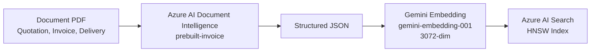
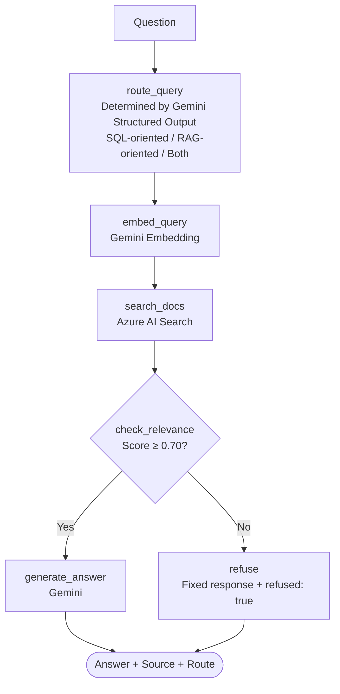

[🇯🇵 日本語](README.md) | [🇬🇧 English](README.en.md)

# order-system-rag

[](https://github.com/yktsnet/order-system-rag/actions/workflows/ci.yml)

A portfolio demonstrating RAG implementation using Azure Document Intelligence + AI Search on transaction document PDFs (unstructured data) in the order domain, with comparative demos against Text-to-SQL to demonstrate "design decisions for selecting tools based on the nature of questions".

Sister repo: [`order-system-migration`](https://github.com/yktsnet/order-system-migration) (Text-to-SQL). These two repos form a set to show "why we choose each method" from both structured and unstructured perspectives.

## Quick Start

### Prerequisites

- Docker Desktop
- API keys for Azure AI Document Intelligence, Azure AI Search, and Gemini API

### Setup

```bash
cp .env.example .env
# Set API keys in .env (see .env.example)
docker compose up -d --build
```

App: http://localhost:8094

## Overview

Under the same order domain and identical questions, compare the differing answers generated by Text-to-SQL and RAG side-by-side.

### Demo UI — 3-tab layout

| Tab | Content |
|---|---|
| Document Management | List of 30 invoice, delivery, and quotation PDFs from partners with JSON previews. Includes a D&D upload area to model the business workflow of continuously arriving documents. |
| Data Search | Two-column comparison of Question -> Text-to-SQL / RAG. A routing node determines the nature of the question to display a recommendation badge and its reasoning. Step logs are provided for each response. |
| Architecture Explanation | Diagrams of structural differences between Text-to-SQL and RAG, explaining the strengths/weaknesses for each question pattern. |

Since the document management tab serves as the main view, the context that "these 30 PDFs are the source data" is naturally carried over to the data search tab.

### Question Patterns and Tool Selection

| Question Example | Text-to-SQL | RAG |
|---|---|---|
| What is the total orders for Tokyo Shoji? | ✅ Sum via `SELECT SUM(...)` | ⚠️ Can output invoice amounts but cannot aggregate all records |
| What is the payment deadline for Tokyo Shoji's invoice? | ❌ No payment deadline field in Orders table | ✅ "July 28, 2026" from document PDF |
| Which is the highest amount invoice? | ❌ Invoice data not in DB | ✅ INV-2026-0010 (approx. 8.14M JPY) |
| What is the sales forecast for next year? | ❌ | ❌ -> Both return no answer |

## Architecture

### Data Pipeline (3 Stages)



### RAG Flow (LangGraph StateGraph)



Possesses two patterns of dynamic branching using `conditional_edges`: LLM routing (execution path changes based on LLM output) and deterministic relevance checking (skips calling LLM if no evidence is found).

## Tech Stack

| Layer | Technology | Reason |
|---|---|---|
| Document Understanding | Azure AI Document Intelligence (prebuilt-invoice) | Structural extraction accuracy and confidence scores of forms are core requirements. A specialized service is more robust than a general multimodal LLM. |
| Vector Search | Azure AI Search (HNSW, 3072 dimensions) | Consolidates the backbone of RAG on Azure to replicate enterprise Azure RAG. The embedding source is flexible by design. |
| Embedding | Gemini `gemini-embedding-001` | Utilizes the free tier (1500 requests/min) to keep the cost of running the demo 24/7 at zero. |
| LLM (Routing & Generation) | Gemini (swappable with Azure OpenAI) | Free tier ensures always-on demo. Switchable to Azure OpenAI for enterprise requirements. |
| RAG Orchestration | LangGraph StateGraph | Implements both LLM branching and deterministic branching patterns in a single graph via conditional_edges. |
| API | FastAPI + Uvicorn | Cohosts API and React static files in a single container to simplify port management. |
| Demo UI | React + TypeScript + Vite + shadcn/ui (Catppuccin Latte) | Uses a Teal accent to visually distinguish it from the sister repo (sky blue). |
| Dependency Management | Nix (nix-shell disposable environment) | Switch language environments without `pip install`. Isolates Docker production and nix-shell development environments. |

## Design Decisions

### Why RAG — Natural Source of Unstructured Data

Order system form inputs only produce validated clean data. Unstructured data exists **externally (documents arriving from business partners)**. Information like payment deadlines on invoices or notes on quotations, which are not natural to store in a database, require RAG queries. As the counterpart to the sister repo where "RAG is excessive for structured fields", this repo handles "unstructured data that SQL cannot reach".

### Adopting Only the Azure AI Layer

Avoids duplicating IaaS/PaaS (VMs, containers) which were proven with AWS ECS in `order-system-migration`. Uses only Azure AI layer services (Document Intelligence, AI Search) via APIs.

### Gemini Default, Swappable Design

Azure OpenAI lacks a free tier and requires access approval. To keep the demo running 24/7, Gemini (free tier) is the default, with the provider separated to allow swapping with Azure OpenAI without changing core RAG functionality.

### LangGraph — Two conditional_edges Patterns

Added dynamic branching via `conditional_edges` (LLM branching for routing, deterministic branching for relevance checks).
Excluded Human-in-the-loop (interrupt) because chatbots require instant response, making it unsuitable.

## Scope

### Focus

- RAG search with evidence on form PDFs (unstructured data)
- Comparative Demo against Text-to-SQL (side-by-side comparison on same domain & questions)
- Practical application of Azure AI Document Intelligence & AI Search
- Branching patterns in LangGraph `conditional_edges` (LLM branching + deterministic branching)
- No-answer policy (insufficient evidence -> skip LLM and return `refused: true`) and source citation

### Out-of-Scope

- Structured aggregation (total amounts, rankings, etc.) — handled by `order-system-migration` (Text-to-SQL)
- Full authentication & authorization
- Large-scale tuning (index tuning, sharding, etc.)
- General-purpose OSS library use — intended for demo/portfolio purposes.

## Deploy

Self-hosted (NixOS) + always-on demo via Cloudflare Tunnel.

```bash
docker compose up -d --build
```

Port `8094` (host) -> `8002` inside container (FastAPI + React static files).

## Development

### Environment Variables

```bash
cp .env.example .env
# Set AZURE_DOCUMENT_INTELLIGENCE_*, AZURE_SEARCH_*, and GEMINI_API_KEY
```

### Generate Sample PDFs

```bash
nix-shell -p python3Packages.reportlab --run "python3 src/generate_samples.py"
```

### Run RAG API (Development Mode)

```bash
nix-shell -p 'python3.withPackages (ps: with ps; [
  google-genai azure-search-documents python-dotenv fastapi uvicorn langgraph
])' --run "uvicorn src.api.main:app --reload --port 8002"
```

### Syntax/Type Checks

```bash
# Backend
nix-shell -p python3 --run "python3 -m py_compile src/api/main.py src/generate/rag.py src/ingest/extract.py src/search/index.py"
# Frontend
cd src/web && npm ci && npm run build
```

> Document Intelligence & AI Search do not have local emulators. Rebuilding indexes directly uses Azure's free tier (F0/Free).
