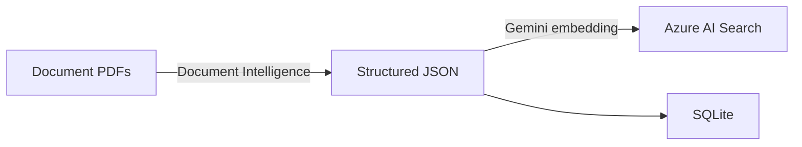

[🇯🇵 日本語](README.md) | [🇬🇧 English](README.en.md)

# order-system-rag

[](https://github.com/yktsnet/order-system-rag/actions/workflows/ci.yml)

A demo that uses trade document PDFs from the procurement domain (quotations, invoices, delivery notes) to show side-by-side how RAG and Text-to-SQL answer the same question differently — demonstrating the design decision of "choosing the right tool based on the nature of the question."

## Quick Start

### Prerequisites

- Docker Desktop
- API keys for Azure AI Document Intelligence, Azure AI Search, and the Gemini API

### Setup

```bash
cp .env.example .env
# Set each API key in .env (see .env.example)
docker compose up -d --build
```

App: http://localhost:8094

## Overview

With 30 document PDFs as the source data, the Demo UI lets you compare a RAG answer and a Text-to-SQL answer side by side for a single question.

| Tab | Content |
|---|---|
| Document Management | A list of 30 quotation, invoice, and delivery-note PDFs received from vendors, with a JSON preview. A drag-and-drop upload area illustrates the "continuously arriving documents" business flow. |
| Data Search | Question → two-column comparison of Text-to-SQL and RAG. The routing node classifies the question type and shows a recommended-method badge with its reasoning. Each answer includes step-level logs. |
| How It Works | Illustrated explanation of the structural differences between Text-to-SQL and RAG, with a question-pattern breakdown of strengths and weaknesses. |

By making the Document Management tab the main view, the context that "these 30 PDFs are the source data" carries naturally into the Data Search tab.

## Architecture

**Ingestion (build time)**: The same JSON extracted from the document PDFs is loaded into both Azure AI Search for vector search and SQLite for structured search. Because RAG and Text-to-SQL reference the same source, the method comparison is fair.



**Query (runtime)**: A LangGraph StateGraph routes each question and executes either the SQL path or the RAG path.


The graph has two types of branching via `conditional_edges`:
- **LLM branching (routing)**: Classifies the question into `sql` or `rag` and switches the execution path accordingly. Because SQL-schema-covered questions are always more accurate with structured data, a "both" classification was intentionally omitted.
- **Deterministic branching (relevance check)**: Compares search scores against a threshold (0.70) and, when evidence is insufficient, routes deterministically to `refused: true` without calling the generation LLM (cost control + hallucination prevention).

The two-column comparison in the Data Search tab uses a separate `force_route` parameter to run both RAG and SQL paths regardless of the automatic routing result.

## Capability Comparison

Results after connecting the same data source to both methods and testing with actual questions.

| Example Question | Text-to-SQL | RAG |
|---|---|---|
| What is Tokyo Shoji's total order amount? | ✅ Aggregated with `SELECT SUM(...)` | ⚠️ Shows amounts from individual documents but cannot aggregate all records |
| What is the payment due date on Tokyo Shoji's invoice? | ⚠️ No payment-due column in schema; cannot generate SQL | ✅ Extracted from the document PDF text |
| Which invoice has the highest amount? | ✅ `ORDER BY invoice_total DESC LIMIT 1` | ⚠️ Can suggest top candidates but cannot guarantee a full-dataset comparison |
| Are there any transactions where the quotation and invoice amounts differ? | ❌ No transaction ID linking quotes and invoices in the schema; SQL generation fails | ❌ Document-level search cannot compare across transactions |
| What is next year's revenue forecast? | ❌ | ❌ → Both methods decline to answer |

Cross-transaction comparisons such as "difference between quotation and invoice" are fundamentally unanswerable by either method. This is not an implementation flaw but a data-model constraint: the `documents` table has no transaction ID linking quotations, deliveries, and invoices. When an answer cannot be given, the LLM infers and explains the specific reason (see [Design Decisions](#design-decisions)).

The baseline measurements that preceded this comparison (foundation defects found by measurement and their fixes) are recorded in [docs/findings.md](docs/findings.md) (Japanese).

## Tech Stack

| Layer | Technology | Rationale |
|---|---|---|
| Document Understanding | Azure AI Document Intelligence (prebuilt-invoice) | Structured-extraction accuracy and confidence scores are at the core of the requirements. A dedicated service is more reliable than a general-purpose multimodal LLM. |
| Vector Search | Azure AI Search (HNSW, 3072 dims) | Consolidates the entire RAG backbone into Azure to replicate enterprise Azure RAG. The embedding provider is free to choose by design. |
| Structured Search | SQLite (`documents` / `items` tables) | Directly tables the extracted document data. At this scale, adding a load target to the existing extract→load pipeline is lightweight enough that a separate service was unnecessary. |
| Embedding | Gemini `gemini-embedding-001` | Free tier (1,500 req/min) keeps the always-on public Demo at zero cost. |
| LLM (routing, SQL generation, generation) | Gemini (swappable to Azure OpenAI) | Free tier sustains always-on availability. Designed so Azure OpenAI can be swapped in for enterprise requirements. |
| Orchestration | LangGraph StateGraph | Implements both LLM branching and deterministic branching patterns in a single graph via `conditional_edges`, splitting SQL and RAG paths. |
| API | FastAPI + Uvicorn | Serves both the API and React static files from a single container, simplifying port management. |
| Demo UI | React + TypeScript + Vite + shadcn/ui (Catppuccin Latte + Teal accent) | — |
| Dependency Management | Nix (disposable nix-shell environments) | Language environments can be switched without `pip install`. Production uses Docker; development uses nix-shell — environments are isolated. |

## Design Decisions

Key points only. The full text of each decision (what was rejected and why) is in [docs/design-decisions.md](docs/design-decisions.md) (Japanese).

- **Compare RAG and Text-to-SQL on the same domain**: Provides empirical grounds to avoid selection mismatches, such as forcing structured aggregation through RAG or SQL-ifying free-text fields.
- **Azure for the AI layer only, Gemini as the generation default**: Document Intelligence and AI Search are used via their APIs, while embedding and generation run on Gemini's free tier to keep the always-on Demo at zero cost (swappable to Azure OpenAI by design).
- **A purpose-built SQL schema**: The existing procurement DB was synthetic data with no shared source, so it was not reused; new `documents` / `items` tables were built to match this repo's extracted JSON.
- **Two-value routing**: Questions covered by the SQL schema are always more accurate with structured data, so the "both" classification was removed.
- **The LLM infers refusal reasons**: The "no assertion without evidence" principle is guaranteed deterministically, and only the verbalization of the reason is delegated to the LLM.

## Scope

### Focus

- Evidence-backed RAG search over document PDFs (unstructured data) and Text-to-SQL comparison against the same data source
- Practical use of Azure AI Document Intelligence and AI Search
- Branching patterns via LangGraph `conditional_edges` (LLM routing branch + deterministic relevance branch)
- No-answer policy (no evidence → LLM infers reason and returns `refused: true`) and citation presentation

### Out-of-Scope

- Full authentication and authorization implementation
- Large-scale operation (index tuning, sharding, etc.)
- General-purpose OSS library use (this is a Demo / portfolio project)
- Cross-transaction comparison (e.g., quotation-to-invoice discrepancies): a data-model constraint where no transaction ID exists in `documents`, making such queries fundamentally unanswerable by either RAG or SQL

## Deploy

Self-hosted (NixOS) + always-on via Cloudflare Tunnel.

```bash
docker compose up -d --build
```

Port `8094` (host) → port `8002` inside the container (FastAPI + React static files).

## Development

See [docs/development.md](docs/development.md) (Japanese) for environment variables, sample PDF generation, index building, running the API, tests, and lint. Dependencies are managed with disposable nix-shell environments; `pip install` is not used.

## How this was built

Development follows an issue-driven workflow that separates design (interactive AI), implementation (autonomous AI), and verification (human merge). An AI agent implements each change starting from an issue file, and dangerous operations are blocked by configuration rather than by convention. The setup lives in [dotfiles-public](https://github.com/yktsnet/dotfiles-public); the process itself is visible in this repository's issues and PRs.
