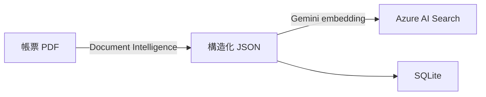

[🇯🇵 日本語](README.md) | [🇬🇧 English](README.en.md)

# order-system-rag

[](https://github.com/yktsnet/order-system-rag/actions/workflows/ci.yml)

発注ドメインの取引先帳票 PDF（見積書・請求書・納品書）を題材に、同じ質問に対して RAG と Text-to-SQL がどう異なる答え方をするかを並べて比較し、「質問の性質でツールを選ぶ設計判断」を実証する。

## Quick Start

### Prerequisites

- Docker Desktop
- Azure AI Document Intelligence・Azure AI Search・Gemini API の各 API キー

### Setup

```bash
cp .env.example .env
# .env に各 API キーを設定（.env.example 参照）
docker compose up -d --build
```

App: http://localhost:8094

## Overview

帳票 PDF 30 枚をソースデータに、1つの質問に対する RAG / Text-to-SQL 両方の回答を並べて確認できる Demo UI を持つ。

| タブ | 内容 |
|---|---|
| 帳票管理 | 取引先から届く見積書・請求書・納品書 30 枚の一覧と JSON プレビュー。D&D アップロードエリアで「継続的に届く帳票」という業務フローを示す |
| データ検索 | 質問 → Text-to-SQL / RAG の2カラム比較。ルーティングノードが質問の性質を判定し推奨バッジ＋理由を表示。各回答にステップログを付与 |
| 仕組み解説 | Text-to-SQL と RAG の構造的な違い・質問パターンごとの得意不得意を図解 |

帳票管理タブがメインビューになることで「この 30 枚の PDF がソースデータである」という文脈がデータ検索タブに自然に引き継がれる。

## Architecture

**取り込み（ビルド時）**: 帳票 PDF から抽出した同一の JSON を、ベクトル検索用の Azure AI Search と構造化検索用の SQLite の両方に登録する。RAG と Text-to-SQL が同一ソースを参照するため、手法比較が公平に成立する。



**クエリ（実行時）**: LangGraph StateGraph が質問をルーティングし、SQL 経路または RAG 経路を実行する。


`conditional_edges` による2種の分岐を1グラフに持つ:
- **LLM 分岐（ルーティング）**: 質問を `sql` / `rag` の2値に判定し、実行パスそのものを分ける。SQL スキーマでカバーできる質問は構造化データの方が常に正確なため「両方」という分類は残していない
- **決定的分岐（relevance チェック）**: 検索スコアを閾値（0.70）と比較し、根拠が不十分なら生成 LLM を呼ばずに `refused: true` の経路へ確定的に分岐する（コスト抑制とハルシネーション防止）

データ検索タブの2カラム比較は、この自動ルーティングとは別に `force_route` パラメータで RAG / SQL 両方を強制実行して並べている。

## Capability Comparison

同一データソースを両手法に接続した上で、実際に質問を投げて確認した結果。

| 質問例 | Text-to-SQL | RAG |
|---|---|---|
| 東京商事の受注合計は？ | ✅ `SELECT SUM(...)` で集計 | ⚠️ 個々の帳票の金額は出るが全件集計はできない |
| 東京商事の請求書の支払期限は？ | ⚠️ スキーマに支払期限の列がなく生成不可 | ✅ 帳票 PDF の文面から抽出 |
| 一番高額な請求書は？ | ✅ `ORDER BY invoice_total DESC LIMIT 1` | ⚠️ 上位候補は出せるが全件比較の保証はない |
| 見積書と請求書で金額に差額がある取引はありますか？ | ❌ 見積・請求を結ぶ取引 ID がスキーマに無く SQL 生成不可 | ❌ 文書単体の検索のため取引を跨いだ比較はできない |
| 来年の売上予測は？ | ❌ | ❌ → 両方とも無回答 |

「見積書と請求書の差額」のような取引跨ぎの比較は、どちらの手法でも原理的に答えられない。これは実装の不備ではなく、`documents` テーブルに見積・納品・請求を結ぶ取引 ID が存在しないというデータモデル上の限界であり、無回答時にはその理由を LLM が推論して具体的に説明する（[Design Decisions](#design-decisions) 参照）。

この比較に先立つベースライン測定の記録（実測で見つかった土台の不具合と修正）は [docs/findings.md](docs/findings.md) にある。

## Tech Stack

| レイヤー | 技術 | 理由 |
|---|---|---|
| 文書理解 | Azure AI Document Intelligence (prebuilt-invoice) | 帳票の構造化精度と信頼度スコアが要件の核。汎用マルチモーダル LLM より専用サービスが堅い |
| ベクタ検索 | Azure AI Search (HNSW, 3072次元) | RAG の背骨ごと Azure に集約しエンタープライズ Azure RAG を再現。embedding の生成元は AI Search の設計上フリー |
| 構造化検索 | SQLite（`documents` / `items` テーブル） | 帳票抽出データをそのまま構造化テーブル化。独立サービスを新設せず、既存の「抽出→登録」工程にロード先を1本足すだけで済む規模のため軽量な選択にした |
| Embedding | Gemini `gemini-embedding-001` | 無料枠（1分1500リクエスト）で常時公開 Demo のコストをゼロに保つ |
| LLM（ルーティング・SQL生成・生成） | Gemini（差し替えで Azure OpenAI） | 恒久無料枠で常時公開を維持。エンタープライズ要件では Azure OpenAI に差し替え可能に設計 |
| オーケストレーション | LangGraph StateGraph | `conditional_edges` で LLM 分岐と決定的分岐の両パターンを1グラフに実装し、SQL経路・RAG経路を分岐させる |
| API | FastAPI + Uvicorn | 単一コンテナで API と React 静的ファイルを同居させ、ポート管理を単純化 |
| Demo UI | React + TypeScript + Vite + shadcn/ui (Catppuccin Latte + Teal アクセント) | — |
| 依存管理 | Nix (nix-shell 使い捨て環境) | pip install なしで言語環境を切り替え可能。本番は Docker、開発は nix-shell で環境を分離 |

## Design Decisions

要点のみ。各判断の全文（何を捨てたか・なぜか）は [docs/design-decisions.md](docs/design-decisions.md) にある。

- **RAG と Text-to-SQL を同一ドメインで比較する**: 構造化集計を無理に RAG でやる・自由記述を無理に SQL 化する、といった選定ミスマッチを実測で避けられるようにする
- **Azure は AI 層のみ、生成は Gemini 既定**: Document Intelligence・AI Search を API 経由で使い、embedding・生成は無料枠の Gemini で常時公開コストをゼロに保つ（Azure OpenAI に差し替え可能な設計）
- **SQL スキーマは自前**: 既存の発注 DB は合成データでソースが揃わず流用せず、本リポの抽出 JSON に合わせた `documents` / `items` テーブルを新設した
- **ルーティングは2値**: SQL でカバーできる質問は構造化データの方が常に正確なため「両方」という分類を廃止した
- **無回答の理由を LLM が推論する**: 「根拠が無ければ答えない」原則は決定的に保証し、理由の言語化のみ LLM に委ねる

## Scope

### Focus

- 帳票 PDF（非構造データ）への根拠付き RAG 検索と、同一データソースに対する Text-to-SQL の比較
- Azure AI Document Intelligence・AI Search の実用
- LangGraph `conditional_edges` による分岐パターン（LLM ルーティング分岐 + 決定的な relevance 分岐）
- 無回答ポリシー（根拠なし → LLM が理由を推論して `refused: true`）と出典提示

### Out-of-Scope

- 認証・認可の本格実装
- 大規模スケール（インデックスチューニング・シャーディング等）
- OSS ライブラリとしての汎用利用（Demo + ポートフォリオ用途）
- 取引を跨いだ比較（見積→請求の差額など）。`documents` に取引 ID が無く、RAG・SQL どちらの手法でも原理的に答えられないデータモデル上の限界

## Deploy

自己ホスト（NixOS）+ Cloudflare Tunnel 経由で常時公開。

```bash
docker compose up -d --build
```

ポート `8094`（ホスト）→ コンテナ内 `8002`（FastAPI + React 静的ファイル）。

## Development

環境変数・サンプル PDF 生成・インデックス構築・API 起動・テスト・lint の手順は [docs/development.md](docs/development.md) を参照。依存管理は nix-shell の使い捨て環境で、pip install は使わない。

## How this was built

設計（対話型 AI）・実装（自律型 AI）・検証（人間のマージ）を分離した Issue 駆動で開発している。実装は Issue ファイルを起点に AI エージェントが行い、危険な操作は運用ルールではなく設定で遮断する。仕組みは [dotfiles-public](https://github.com/yktsnet/dotfiles-public) に、過程は本リポジトリの Issue と PR に残している。
