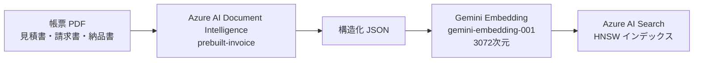
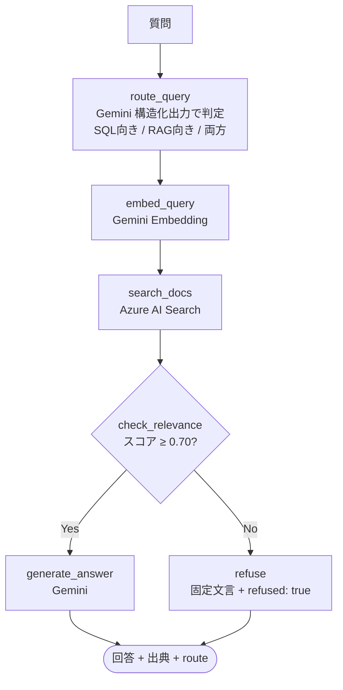

# order-system-rag

発注ドメインの取引先帳票 PDF（非構造データ）を Azure Document Intelligence + AI Search で RAG 化し、Text-to-SQL との手法比較 Demo を通じて「質問の性質でツールを選ぶ設計判断」を実証するポートフォリオ。

姉妹リポ [`order-system-migration`](https://github.com/yktsnet/order-system-migration)（Text-to-SQL）と2本セットで、構造化 / 非構造の両側から「なぜその手法か」を示す。

## Quick Start

### Prerequisites

- Docker Desktop
- Azure AI Document Intelligence・Azure AI Search・Gemini API の各 API キー

### Setup

```bash
cp .env.example .env
# .env に各 API キーを設定（.env.example 参照）
docker compose up -d --build
```

App: http://localhost:8094

## Overview

同じ発注ドメイン・同じ質問に対して、**Text-to-SQL と RAG が異なる手法で回答する様子を並べて比較する**。

### Demo UI — 3タブ構成

| タブ | 内容 |
|---|---|
| 帳票管理 | 取引先から届く見積書・請求書・納品書 30 枚の一覧と JSON プレビュー。D&D アップロードエリアで「継続的に届く帳票」という業務フローを示す |
| データ検索 | 質問 → Text-to-SQL / RAG の2カラム比較。ルーティングノードが質問の性質を判定し推奨バッジ＋理由を表示。各回答にステップログを付与 |
| 仕組み解説 | Text-to-SQL と RAG の構造的な違い・質問パターンごとの得意不得意を図解 |

帳票管理タブがメインビューになることで「この 30 枚の PDF がソースデータである」という文脈がデータ検索タブに自然に引き継がれる。

### 質問パターンと手法の使い分け

| 質問例 | Text-to-SQL | RAG |
|---|---|---|
| 東京商事の受注合計は？ | ✅ `SELECT SUM(...)` で集計 | ⚠️ 請求書の金額は出るが全件集計はできない |
| 東京商事の請求書の支払期限は？ | ❌ Orders テーブルに支払期限がない | ✅ 帳票 PDF から「2026年7月28日」 |
| 一番高額な請求書は？ | ❌ 請求書データが DB にない | ✅ INV-2026-0010（約814万円） |
| 来年の売上予測は？ | ❌ | ❌ → 両方とも無回答 |

## Architecture

### データパイプライン（3ステージ）



### RAG フロー（LangGraph StateGraph）



`conditional_edges` による2種の分岐を1グラフに持つ: LLM ルーティング（実行パスが LLM の出力で変わる）と決定的な relevance チェック（根拠なしなら LLM を呼ばない）。

## Tech Stack

| レイヤー | 技術 | 理由 |
|---|---|---|
| 文書理解 | Azure AI Document Intelligence (prebuilt-invoice) | 帳票の構造化精度と信頼度スコアが要件の核。汎用マルチモーダル LLM より専用サービスが堅い |
| ベクタ検索 | Azure AI Search (HNSW, 3072次元) | RAG の背骨ごと Azure に集約しエンタープライズ Azure RAG を再現。embedding の生成元は AI Search の設計上フリー |
| Embedding | Gemini `gemini-embedding-001` | 無料枠（1分1500リクエスト）で常時公開 Demo のコストをゼロに保つ |
| LLM（ルーティング・生成） | Gemini（差し替えで Azure OpenAI） | 恒久無料枠で常時公開を維持。エンタープライズ要件では Azure OpenAI に差し替え可能に設計 |
| RAG オーケストレーション | LangGraph StateGraph | conditional_edges で LLM 分岐と決定的分岐の両パターンを1グラフで実装 |
| API | FastAPI + Uvicorn | 単一コンテナで API と React 静的ファイルを同居させ、ポート管理を単純化 |
| Demo UI | React + TypeScript + Vite + shadcn/ui (Catppuccin Latte) | Teal アクセントで姉妹リポ（sky 青系）と配色を分け、別プロジェクトであることを視覚的に明示 |
| 依存管理 | Nix (nix-shell 使い捨て環境) | pip install なしで言語環境を切り替え可能。本番は Docker、開発は nix-shell で環境を分離 |

## Design Decisions

### なぜ RAG か — 非構造データの自然な発生源

発注システムのフォーム入力はバリデーション済みのクリーンなデータしか生まない。非構造データは内側ではなく**外部（取引先から届く帳票）**に存在する。請求書の支払期限・見積の注記など、DB に持つ設計が自然でない情報は RAG が必要な問いになる。姉妹リポが「構造化フィールドだから RAG は過剰」と判断した裏面として、本リポは「SQL が原理的に届かない非構造データ」の側を担う。

### Azure の AI 層のみを採用

IaaS/PaaS（VM・コンテナ基盤）は `order-system-migration` の AWS ECS で証明済みのため重複を避け、**Document Intelligence・AI Search という Azure の AI 層サービスのみを API 経由で使用**する。使い方は Gemini API を叩くのと同様だが、役割は文書解析と検索インフラという専門サービス。

### 生成は Gemini 既定・差し替え可能に設計

Azure OpenAI は恒久無料枠がなくアクセス申請が要る唯一の課金ポイント。Demo の常時公開を維持するため生成は Gemini（無料枠）を既定とし、provider を分離して Azure OpenAI に差し替えられる設計にした。取り込みと検索が Azure に集約されていれば主題は成立し、生成 provider の選択は主題を揺るがさない。

### LangGraph — conditional_edges の2パターン

姉妹リポの LangGraph が基本的なノード直列連結だったのに対し、本リポでは `conditional_edges` による動的分岐を加えた。

- **LLM 分岐（ルーティング）**: 入口の質問を Gemini の構造化出力で「SQL 向き / RAG 向き / 両方」に判定。実行パスが LLM の出力で変わる。
- **決定的分岐（relevance チェック）**: 検索スコアを閾値（0.70）と比較し、根拠が不十分なら LLM を呼ばず固定文言を返す。コスト抑制とハルシネーション防止の安全策。

Human-in-the-loop（interrupt による中断→人間判断）は見送り。チャットボットは即応が価値であり、バックグラウンドエージェント向けのパターンが検索チャットボットには合わないと判断した。

## Scope

### Focus

- 帳票 PDF（非構造データ）への根拠付き RAG 検索
- Text-to-SQL との手法比較 Demo（同一ドメイン・同一質問での並列比較）
- Azure AI Document Intelligence・AI Search の実用
- LangGraph `conditional_edges` による分岐パターン（LLM 分岐 + 決定的分岐）
- 無回答ポリシー（根拠なし → LLM を呼ばず `refused: true`）と出典提示

### Out-of-Scope

- 構造化集計（金額合計・ランキング等）— `order-system-migration`（Text-to-SQL）の領分
- 認証・認可の本格実装
- 大規模スケール（インデックスチューニング・シャーディング等）
- OSS ライブラリとしての汎用利用 — Demo + ポートフォリオ用途

## Deploy

自己ホスト（NixOS）+ Cloudflare Tunnel 経由で常時公開。

```bash
docker compose up -d --build
```

ポート `8094`（ホスト）→ コンテナ内 `8002`（FastAPI + React 静的ファイル）。

## Development

### 環境変数

```bash
cp .env.example .env
# AZURE_DOCUMENT_INTELLIGENCE_*, AZURE_SEARCH_*, GEMINI_API_KEY を設定
```

### サンプル PDF 生成

```bash
nix-shell -p python3Packages.reportlab --run "python3 src/generate_samples.py"
```

### RAG API 起動（開発モード）

```bash
nix-shell -p 'python3.withPackages (ps: with ps; [
  google-genai azure-search-documents python-dotenv fastapi uvicorn langgraph
])' --run "uvicorn src.api.main:app --reload --port 8002"
```

### 構文チェック / 型チェック

```bash
# バックエンド
nix-shell -p python3 --run "python3 -m py_compile src/api/main.py src/generate/rag.py src/ingest/extract.py src/search/index.py"
# フロントエンド
cd src/web && npm ci && npm run build
```

> Document Intelligence・AI Search はローカルエミュレータがない。インデックス再構築（`src/ingest/extract.py`・`src/search/index.py`）は Azure の無料枠（F0・Free）を直接使用する。
