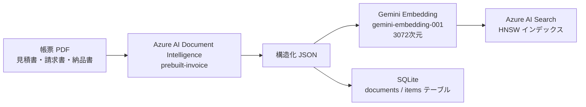
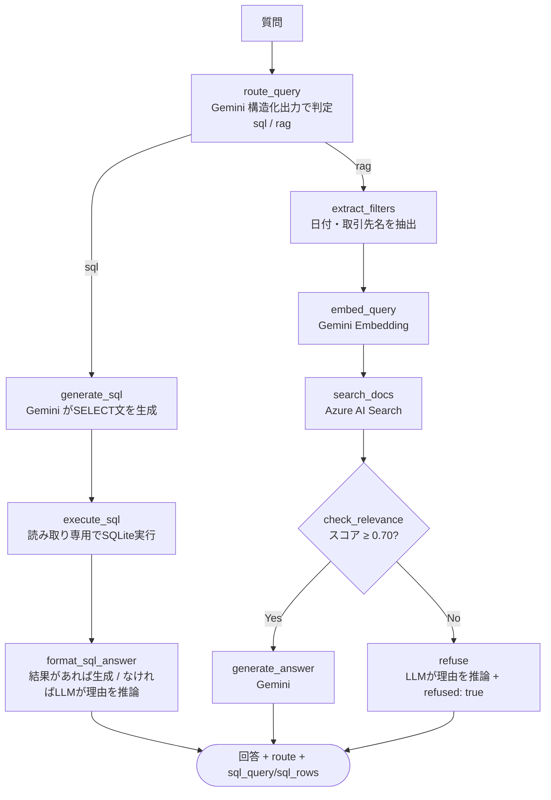

[🇯🇵 日本語](README.md) | [🇬🇧 English](README.en.md)

# order-system-rag

[](https://github.com/yktsnet/order-system-rag/actions/workflows/ci.yml)

発注ドメインの取引先帳票 PDF（見積書・請求書・納品書）を題材に、同じ質問に対して RAG と Text-to-SQL がどう異なる答え方をするかを並べて比較し、「質問の性質でツールを選ぶ設計判断」を実証する。

## Quick Start

### Prerequisites

- Docker Desktop
- Azure AI Document Intelligence・Azure AI Search・Gemini API の各 API キー

### Setup

```bash
cp .env.example .env
# .env に各 API キーを設定（.env.example 参照）
docker compose up -d --build
```

App: http://localhost:8094

## Overview

帳票 PDF から抽出した同一データを、ベクトル検索用（Azure AI Search）と構造化検索用（SQLite）の2箇所に登録し、1つの質問に対して RAG / Text-to-SQL 両方の回答を並べて確認できる。

### Demo UI

| タブ | 内容 |
|---|---|
| 帳票管理 | 取引先から届く見積書・請求書・納品書 30 枚の一覧と JSON プレビュー。D&D アップロードエリアで「継続的に届く帳票」という業務フローを示す |
| データ検索 | 質問 → Text-to-SQL / RAG の2カラム比較。ルーティングノードが質問の性質を判定し推奨バッジ＋理由を表示。各回答にステップログを付与 |
| 仕組み解説 | Text-to-SQL と RAG の構造的な違い・質問パターンごとの得意不得意を図解 |

帳票管理タブがメインビューになることで「この 30 枚の PDF がソースデータである」という文脈がデータ検索タブに自然に引き継がれる。

## Architecture

### Data Pipeline



同じ抽出結果（JSON）を、ベクトル検索用の Azure AI Search と、構造化検索用の SQLite の両方に登録する。RAG と Text-to-SQL が同一ソースを参照するため、手法比較が公平に成立する。

### Query Flow (LangGraph StateGraph)



`conditional_edges` による2種の分岐を1グラフに持つ:
- **LLM 分岐（ルーティング）**: 質問を `sql` / `rag` の2値に判定し、実行パスそのものを分ける。SQL スキーマでカバーできる質問は構造化データの方が常に正確なため「両方」という分類は残していない
- **決定的分岐（relevance チェック）**: 検索スコアを閾値（0.70）と比較し、根拠が不十分なら生成 LLM を呼ばずに `refused: true` の経路へ確定的に分岐する（コスト抑制とハルシネーション防止）

データ検索タブの2カラム比較は、この自動ルーティングとは別に `force_route` パラメータで RAG / SQL 両方を強制実行して並べている。

## Findings

「RAG をどれだけ技術的に使ったと言えるか」を自己評価する過程で、Hybrid検索や評価指標を追加する前に、実際にベースラインの Retrieval を手動で測定した。結果、想定していた弱点（ベクトル検索が似た文書を混同する）はほぼ起きておらず、代わりに想定していなかった種類の問題が見つかった。「先進的な技術を足して精度を上げる」より、「測ったら土台に不具合があった、直したら改善した」という優先順位で進めた。

### Baseline Issues Found by Measurement

- **`doc_type` が実態を表していなかった**: Document Intelligence の `prebuilt-invoice` モデルが返す固定ラベルをそのまま使っており、見積書/納品書/請求書を実際に分類した値ではなかった。ファイル名 prefix からの再分類で修正した
- **メタデータフィルタが未接続だった**: 日付・取引先名という決定的な手がかりがベクトル検索にほぼ効いていなかった（正解と2位のスコア差がほぼゼロのケースを確認）。`_search()` にフィルタを接続して解消した
- **ルーティングは分類するだけで分岐していなかった**: `route_query` は判定結果を返すのみで、後続のグラフは常に RAG 経路のみを通っていた。`add_conditional_edges` で実際に分岐させた

### Revisiting the Text-to-SQL Integration

当初は既存の発注 DB と連携し同じ取引先・商品で比較する構想だったが、調査の結果その DB は独立した合成データで本リポの PDF とは無関係、かつデータモデルも「見積→納品→請求」という3段階の文書ライフサイクルとは別物（カテゴリ別集計向けのフラットな注文記録）だと判明した。既存 DB との連携は諦め、本リポの抽出データ（`src/ingest/extracted/*.json`）に合わせた新しい SQL スキーマ（`documents` / `items`）を自前で用意する方針に変更した。

### Capability Comparison

同一データソースを両手法に接続した上で、実際に質問を投げて確認した結果。

| 質問例 | Text-to-SQL | RAG |
|---|---|---|
| 東京商事の受注合計は？ | ✅ `SELECT SUM(...)` で集計 | ⚠️ 個々の帳票の金額は出るが全件集計はできない |
| 東京商事の請求書の支払期限は？ | ⚠️ スキーマに支払期限の列がなく生成不可 | ✅ 帳票 PDF の文面から抽出 |
| 一番高額な請求書は？ | ✅ `ORDER BY invoice_total DESC LIMIT 1` | ⚠️ 上位候補は出せるが全件比較の保証はない |
| 見積書と請求書で金額に差額がある取引はありますか？ | ❌ 見積・請求を結ぶ取引 ID がスキーマに無く SQL 生成不可 | ❌ 文書単体の検索のため取引を跨いだ比較はできない |
| 来年の売上予測は？ | ❌ | ❌ → 両方とも無回答 |

「見積書と請求書の差額」のような取引跨ぎの比較は、どちらの手法でも原理的に答えられない。これは実装の不備ではなく、`documents` テーブルに見積・納品・請求を結ぶ取引 ID が存在しないというデータモデル上の限界であり、無回答時にはその理由を LLM が推論して具体的に説明する（Design Decisions 参照）。

## Tech Stack

| レイヤー | 技術 | 理由 |
|---|---|---|
| 文書理解 | Azure AI Document Intelligence (prebuilt-invoice) | 帳票の構造化精度と信頼度スコアが要件の核。汎用マルチモーダル LLM より専用サービスが堅い |
| ベクタ検索 | Azure AI Search (HNSW, 3072次元) | RAG の背骨ごと Azure に集約しエンタープライズ Azure RAG を再現。embedding の生成元は AI Search の設計上フリー |
| 構造化検索 | SQLite（`documents` / `items` テーブル） | 帳票抽出データをそのまま構造化テーブル化。独立サービスを新設せず、既存の「抽出→登録」工程にロード先を1本足すだけで済む規模のため軽量な選択にした |
| Embedding | Gemini `gemini-embedding-001` | 無料枠（1分1500リクエスト）で常時公開 Demo のコストをゼロに保つ |
| LLM（ルーティング・SQL生成・生成） | Gemini（差し替えで Azure OpenAI） | 恒久無料枠で常時公開を維持。エンタープライズ要件では Azure OpenAI に差し替え可能に設計 |
| オーケストレーション | LangGraph StateGraph | `conditional_edges` で LLM 分岐と決定的分岐の両パターンを1グラフに実装し、SQL経路・RAG経路を分岐させる |
| API | FastAPI + Uvicorn | 単一コンテナで API と React 静的ファイルを同居させ、ポート管理を単純化 |
| Demo UI | React + TypeScript + Vite + shadcn/ui (Catppuccin Latte + Teal アクセント) | — |
| 依存管理 | Nix (nix-shell 使い捨て環境) | pip install なしで言語環境を切り替え可能。本番は Docker、開発は nix-shell で環境を分離 |

## Design Decisions

### Why Compare RAG and Text-to-SQL

発注業務では、フォーム入力＋バリデーション済みのクリーンな構造化データと、取引先から届く帳票 PDF の非構造な文面が両方発生する。同じドメイン・同じ質問に両手法をぶつけることで、「どちらの手法が何に強く、何に届かないか」を実測ベースで示す。売上集計・ランキングのような構造化集計を無理に RAG でやる、あるいは支払期限・特記事項のような自由記述を無理に SQL 化する、といった選定ミスマッチを避けることが主眼。

### Azure AI Layer Only

VM・コンテナ基盤（IaaS/PaaS）は他プロジェクトで実績があるため重複を避け、**Document Intelligence・AI Search という Azure の AI 層サービスのみを API 経由で使用**する。無料枠（AI Search Free・Document Intelligence F0）で Demo 規模は十分カバーできる。

### Search Layer and Embedding Are Decoupled

Azure AI Search はインデックス＋ベクタ検索のインフラであり、embedding を誰が生成するかは問わない設計。検索は Azure AI Search、embedding は Gemini（無料枠でコストゼロ）と分離している。pgvector でも RAG は成立するが、主題が「Azure で実用」である以上 AI Search を採る。

### Generation Defaults to Gemini, Swappable by Design

Azure OpenAI は恒久無料枠がなくアクセス申請が要る唯一の課金ポイント。Demo の常時公開を維持するため生成は Gemini（無料枠）を既定とし、provider を分離して Azure OpenAI に差し替えられる設計にした。取り込みと検索が Azure に集約されていれば主題は成立し、生成 provider の選択は主題を揺るがさない。

### Routing Collapsed to Two Values

ルーティングは当初「SQL / RAG / 両方」の3値を想定していたが、SQL スキーマでカバーできる質問は構造化データの方が常に正確なため、実行パスを一意に決められる。「両方」は分類として残す意味が無く廃止し、`Literal["sql", "rag"]` に整理した。

### Safety Boundary — Let the LLM Reason About Why It Can't Answer

「検索結果／SQL実行結果に無いことは答えない」を保証し、RAG は根拠とした文書のファイル名を出典として提示する。SQL 経路は「SELECT のみ許可」（禁止キーワード検査・読み取り専用接続）を被害の境界とする。

無回答時は固定文言ではなく、何を探して見つからなかったかを LLM に推論させて返す。ただし文書内容やデータ内容そのものは理由生成プロンプトに渡さず、検索条件・スコア・SQL 実行エラー・ルーティング判定理由のみを材料にする（「根拠が無ければ断定しない」原則は維持したまま、理由の言語化のみ LLM に委ねる）。Gemini 呼び出しが失敗した場合は固定文言にフォールバックする。

また、上位候補が僅差で1件に絞り込めない曖昧な質問については、断定回答を避け「候補が複数あり区別できない」旨を答えるよう生成プロンプトに指示している。「曖昧な質問」と「データに無い質問」は症状の出るレイヤーが違うだけで、本質的には同じ「どこまで自信を持って答えるか」というポリシーの話であり、新しい分類レイヤーや聞き返し UI は作らず、各経路（RAG・SQL）が自己完結のガードとして持つ設計にした。

### What We Skipped

- **Human-in-the-loop**（`interrupt` によるフロー中断→人間判断→再開）。チャットボットは即応が価値であり、途中で止めて承認を求める体験は不自然。HITL はバックグラウンドエージェント（長時間タスク、外部システムへの書き込み）向けのパターンであり、検索チャットボットには合わない
- **SQL 生成の自己修正ループ**（`execute_sql` が 0 件・エラーの場合に `generate_sql` へフィードバックして再生成させる循環エッジ）。LangGraph の循環グラフが素直に効く領域だが、リトライ上限の制御が要りデモの複雑度が上がる割に、今のデータ規模（30件）では効果が測定しにくいと判断
- **SQL 生成前の事前グラウンディングノード**（`MIN/MAX(invoice_date)` 等の統計を先に取得してプロンプトに含める独立ノード）。範囲外の日付質問での誤った SQL 生成を減らせる可能性はあるが、まず「答えられるようにする」より「なぜ答えられないかを正確に説明する」ことを優先し、未着手のまま保留
- **取引跨ぎ比較の解消**（GraphRAGによる文書間関係の保持、またはRAG検索結果のinvoice_idでSQLを引くようなマルチホップ・エージェント的構成）。取引ID自体をスキーマに追加する方が素直な解決だが、それをしない前提でも上記のアプローチは原理上可能。ただし今のデータ規模・質問パターン数ではグラフ構築やマルチステップ推論のオーバーヘッドに見合う効果測定が難しく、見送った

## Scope

### Focus

- 帳票 PDF（非構造データ）への根拠付き RAG 検索と、同一データソースに対する Text-to-SQL の比較
- Azure AI Document Intelligence・AI Search の実用
- LangGraph `conditional_edges` による分岐パターン（LLM ルーティング分岐 + 決定的な relevance 分岐）
- 無回答ポリシー（根拠なし → LLM が理由を推論して `refused: true`）と出典提示

### Out-of-Scope

- 認証・認可の本格実装
- 大規模スケール（インデックスチューニング・シャーディング等）
- OSS ライブラリとしての汎用利用 — Demo + ポートフォリオ用途
- 取引を跨いだ比較（見積→請求の差額など）— `documents` に取引 ID が無く、RAG・SQL どちらの手法でも原理的に答えられないデータモデル上の限界

## Deploy

自己ホスト（NixOS）+ Cloudflare Tunnel 経由で常時公開。

```bash
docker compose up -d --build
```

ポート `8094`（ホスト）→ コンテナ内 `8002`（FastAPI + React 静的ファイル）。

## Development

### Environment Variables

```bash
cp .env.example .env
# AZURE_DOCUMENT_INTELLIGENCE_*, AZURE_SEARCH_*, GEMINI_API_KEY を設定
```

### Generate Sample PDFs

```bash
nix-shell -p python3Packages.reportlab --run "python3 src/generate_samples.py"
```

### Load SQLite Tables

```bash
nix-shell -p python3 --run "python3 src/search/sqlite_load.py"
```

### Run the API (Dev Mode)

```bash
nix-shell -p 'python3.withPackages (ps: with ps; [
  google-genai azure-search-documents python-dotenv fastapi uvicorn langgraph
])' --run "uvicorn src.api.main:app --reload --port 8002"
```

### Run Tests

```bash
nix-shell -p 'python3.withPackages (ps: with ps; [ pytest pytest-mock fastapi ])' --run "pytest tests/"
```

### Lint / Type Check

```bash
# バックエンド
nix-shell -p python3 --run "python3 -m py_compile src/api/main.py src/generate/rag.py src/ingest/extract.py src/search/index.py src/search/sqlite_load.py"
# フロントエンド
cd src/web && npm ci && npm run build
```

> Document Intelligence・AI Search はローカルエミュレータがない。インデックス再構築（`src/ingest/extract.py`・`src/search/index.py`）は Azure の無料枠（F0・Free）を直接使用する。
